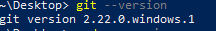
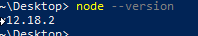
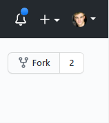
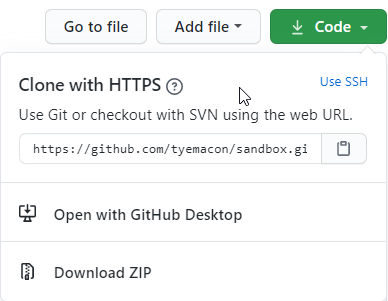

# sandbox
A safe place to play with yourself.

## Requirements

#### Git
If you made it this far, it is likely you have already set up an account. If not, do that. 
Before you can pull this repository down to your machine, you'll need to install git. Select default
options for anything during setup that you're asked for. Follow the link here for basic installation
instructions https://www.atlassian.com/git/tutorials/install-git#windows
Verify your git installation by opening your terminal of choice and typing git --version

#### Node
Download the most recent (LTS) version of Node here https://nodejs.org/en/.
Alternatively, go here for installation steps to take care of the Expo as well https://expo.io/learn.
Confirm your Node installation by opening your terminal of choice and typing node --version

#### Expo
!! Must install Node before installing Expo !!
Expo is a bundler that this app runs on while in development mode (now). Downloading Node in the previous step 
will have added a package manager called 'npm' to your machine. Simply open your terminal and enter `npm install expo-cli --global`

## To Use
Fork this repository to your account. In the upper right hand corner you should find a button labeled 'Fork'

This will fork a copy of the repository over to *your* account. Go to your github page. If you can't automatically see your copy of this repository, 
click on 'Repositories' and you should find it there. Now click the green drop down button on your repository's page

Copy the url in the box to your clipboard. Open your terminal and navigate to the directory in which you'd like to clone the folder into (it will make a folder called sandbox)
This is a lovely opportunity to learn some basic terminal commands, which will be very useful. https://dev.to/kymiddleton/reference-guide-common-commands-for-terminal-6no
In general you can do everything you need with `cd` (change directory) and `ls` (list... something? it lists everything in the folder you're in. `ls -a` (all) to show hidden files). The other commands could be ignored.

Once you are in the directory you'd like to clone the repository type `git clone` and then past the url in your clipboard after - `git clone https://github.com/your_username/sandbox.git`. If you haven't set up your git username and password as global variables to your system you will be prompted for credentials.

After the repository finishes downloading, cd into it - `cd sandbox` and type the command `npm install`. This will install all of the external libraries and modules needed for the app, it might take a second. 

Once it's down downloading, simply type `npm start` and a browser window should pop up displaying a QR code for you to scan and open the app on your phone. Additionally you can download a particular emulator (Android or iOS) and run it through there. 

## To Play
Download a code editor of your choice. I am partial to Visual Studio Code, but there are tons of options. https://code.visualstudio.com/. Open the file you'd like to tinker with and your changes should show on save.

## Technology
This app is built with React-Native. To learn more about React-Native go here https://reactnative.dev/. React-Native is a sister of React https://reactjs.org/. (One is for phones and one is for web) Both use stylesheets, or the like, with tags that are very similar to CSS styling. For example, to alter the font size of text within a 
 (paragraph) tag in HTML would use the tag `font-size`, while to do the same within a React 
 or a React-Native <Text> would be `fontSize`. Depending on how deep you want to go in learning things, starting with css and html are great foundations, as React is built around HTML (web-browser speak)
  
Additionally, if you'd prefer to tinker with React rather than the React-Native found here, follow the same Fork -> Clone -> `cd directory` -> `npm install` -> `npm start` set of instructions above with this repository https://github.com/tyemacon/blitz-chess.git
